# 🛡️ CyberBank Security Game (v2.0)
### *Futuristic Cyberpunk Hacker HUD - Core Banking Security Operations Simulator*

[](https://c25web.site/)
[](https://github.com/)
[](https://opensource.org/licenses/MIT)

**CyberBank Security Game v2.0** là một ứng dụng web mô phỏng đào tạo và thực hành an toàn thông tin tương tác cao. Trong game, người chơi sẽ hóa thân thành một **Operator An Ninh Mạng (Security Operator)** chịu trách nhiệm cấu hình và vận hành hệ thống phòng thủ mật mã học cho các giao dịch tài chính của Core Banking chống lại các cuộc tấn công mạng nguy hiểm từ **Attacker Bot**.

👉 **Triển khai thực tế tại:** [https://c25web.site/](https://c25web.site/)

---

## 📖 Mục lục
1. [Tính năng nổi bật](#-tính-năng-nổi-bật)
2. [Kiến trúc & Luồng kỹ thuật mật mã](#-kiến-trúc--luồng-kỹ-thuật-mật-mã)
3. [Công nghệ sử dụng](#-công-nghệ-sử-dụng)
4. [Hướng dẫn cài đặt & Chạy dự án](#-hướng-dẫn-cài-đặt--chạy-dự-án)
5. [Hướng dẫn chơi & Vận hành](#-hướng-dẫn-chơi--vận-hành)
6. [Chi tiết 15 Màn chơi Chiến dịch](#-chi-tiết-15-màn-chơi-chiến-dịch)
7. [Chi tiết 8 Thẻ phòng thủ & Use Case](#-chi-tiết-8-thẻ-phòng-thủ--use-case)
8. [Giao diện ứng dụng thực tế](#-giao-diện-ứng dụng-thực-tế)
9. [Cấu trúc thư mục dự án](#-cấu-trúc-thư-mục-dự-án)

---

## 🌟 Tính năng nổi bật

*   **15 Cấp độ chiến dịch thực chiến (Campaign Mode):** Đi từ cấp độ Dễ (xác thực giao dịch cơ bản) đến Ác mộng (Boss fight - Tấn công mạng tổng lực). Người chơi phải đối mặt với các lỗ hổng thực tế như MITM Tampering, Replay Attack, Invalid Signatures, Expired Transactions và Rogue Encryption Keys.
*   **Phòng thí nghiệm tự do (Sandbox Mode):** Cho phép người chơi tự cấu hình kịch bản tấn công và phối hợp tùy chọn 8 lá bài phòng thủ để quan sát sự thay đổi dữ liệu theo thời gian thực.
*   **Bộ kiểm thử tuân thủ tự động (Compliance Test Suite):** Giả lập chạy kiểm thử tự động một loạt các test case bảo mật bắt buộc của ngân hàng để xuất báo cáo đánh giá an toàn hệ thống dạng Markdown trực quan.
*   **Giao diện HUD Cyberpunk cực hạn:** Thiết kế tối màu kết hợp đèn Neon xanh/hồng/amber, mô phỏng màn hình tác chiến của hacker, đi kèm hiệu ứng quét laser mạng và bảng Hex Dump bộ nhớ nhấp nháy động báo lỗi.
*   **Bảng xếp hạng (Leaderboard) & Nhật ký kiểm toán (History Audit):** So sánh năng lực của các Operator theo điểm tích lũy và cho phép truy vết chi tiết từng gói tin (envelopes) đã được gửi lên hệ thống cùng nhật ký logs phân cấp.
*   **Nhạc nền và Sound FX Synthwave:** Tự động tổng hợp nhạc nền âm hưởng Cyberpunk Synthwave và các hiệu ứng âm thanh (Click, Alarm, Success, Card select) trực tiếp từ trình duyệt bằng **Web Audio API** mà không cần tải bất kỳ file âm thanh tĩnh (.mp3/.wav) nào.

---

## 📡 Kiến trúc & Luồng kỹ thuật mật mã

Dự án mô phỏng chính xác các luồng xử lý mật mã học của một giao dịch tài chính thông qua 3 sơ đồ kỹ thuật cốt lõi dưới đây:

### 1. Quy trình tạo giao dịch tại Client (Transaction Creation Flow)
Khi người dùng Alice thực hiện chuyển tiền cho Bob, Client sẽ đóng gói dữ liệu và thực hiện các bước bảo vệ:
*   Tạo payload dạng **Canonical JSON** chuẩn hóa nhằm tránh sai lệch ký tự thụ động.
*   Băm (Hash) payload bằng thuật toán **SHA-256**.
*   Sử dụng khóa riêng tư RSA (Private Key) để ký số lên hàm băm, tạo ra **Chữ ký số RSA-PSS**.
*   Mã hóa toàn bộ dữ liệu nhạy cảm bằng **AES-256-GCM** tạo ra bản mã (ciphertext) và thẻ xác thực (tag).
*   Đóng gói tất cả thông tin vào một **Transaction Envelope** để truyền đi.

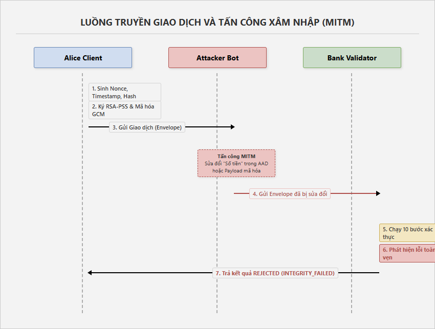

### 2. Pipeline xác thực của máy chủ ngân hàng (Bank Validation Pipeline)
Khi nhận được Transaction Envelope, máy chủ Core Banking sẽ đưa gói tin qua một chuỗi chốt kiểm định an ninh tuần tự. Nếu người chơi trang bị thiếu thẻ bảo mật tương ứng hoặc gói tin bị lỗi ở bất kỳ chốt nào, giao dịch sẽ lập tức bị từ chối (REJECTED):

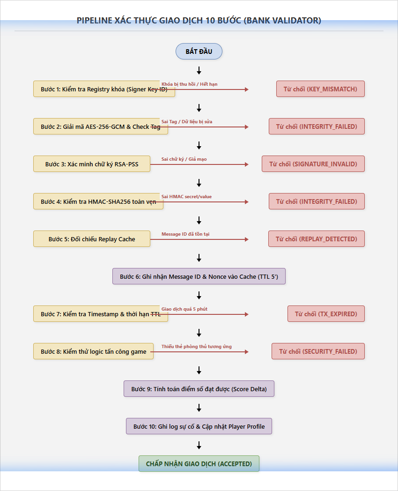

### 3. Cơ chế phát hiện Replay Attack (Replay Detection Model)
Để chống lại việc kẻ xấu thu thập gói tin hợp lệ và phát lại nhiều lần, hệ thống sử dụng cơ chế phối hợp 3 thành phần:
*   **Nonce Check:** Đảm bảo số ngẫu nhiên đính kèm chỉ xuất hiện một lần duy nhất.
*   **Timestamp/TTL Check:** Từ chối các gói tin có thời gian tạo lệch quá 5 phút so với đồng hồ hệ thống của ngân hàng.
*   **Replay Cache Lock:** Tra cứu nhanh danh sách `message_id` đã được xử lý trong RAM, khóa ngay lập tức nếu phát hiện trùng lặp ID.

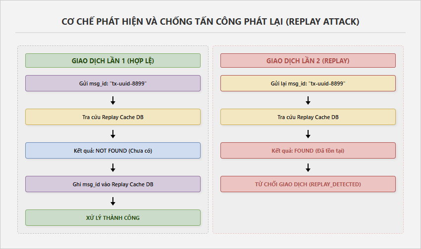

---

## 🛠️ Công nghệ sử dụng

### Backend (Core Server)
*   **Express & Node.js (TypeScript):** Hệ thống API Endpoint quản lý tài khoản, màn chơi, lịch sử và xác thực.
*   **MySQL & mysql2:** Quản lý cơ sở dữ liệu quan hệ cho tài khoản, profiles, cấp độ game, lịch sử lần thử, replay cache và score events.
*   **Cryptographic Core:** Sử dụng thư viện `crypto` tích hợp sẵn của Node.js để xây dựng các thuật toán bảo mật chính xác:
    *   **AES-256-GCM** (Mã hóa đối xứng có xác thực).
    *   **RSA-PSS** (Ký số bất đối xứng độ dài 1024-bit).
    *   **HMAC-SHA256** (Mã xác thực thông điệp khóa đối xứng).
    *   **SHA-256** (Hàm băm một chiều).

### Frontend (User Interface)
*   **React & Vite:** Thư viện giao diện chính và công cụ build nhanh.
*   **Zustand:** Quản lý trạng thái đăng nhập, phiên chơi game (sessions).
*   **Framer Motion:** Tạo các chuyển động mượt mà, hiệu ứng chuyển tab HUD và hiệu ứng quét laser.
*   **Lucide React:** Bộ icon chuyên nghiệp phong cách tối giản.
*   **Custom CSS Grid & Neon:** Thiết kế giao diện HUD mô phỏng bảng điều khiển tàu vũ trụ hoặc thiết bị hacker cyberpunk.
*   **Web Audio API Synth:** Trình tổng hợp âm thanh bằng code, tự sinh sóng âm để tạo nhạc nền và hiệu ứng còi báo động.

---

## 🚀 Hướng dẫn cài đặt & Chạy dự án

### Yêu cầu hệ thống
*   **Node.js:** Phiên bản 18.x trở lên.
*   **MySQL:** Phiên bản 8.0 trở lên.

### Bước 1: Clone dự án và Cài đặt thư viện
```bash
# Cài đặt toàn bộ dependencies ở thư mục gốc
npm install

# Cài đặt dependencies cho thư mục frontend
npm install --prefix src/frontend
```

### Bước 2: Cấu hình biến môi trường
Tạo file `.env` ở thư mục gốc dựa theo mẫu `.env.example`:
```env
PORT=3000
DB_HOST=localhost
DB_PORT=3306
DB_USER=your_mysql_user
DB_PASS=your_mysql_password
DB_NAME=cyberbank_security_game
JWT_ACCESS_SECRET=your_jwt_neon_glow_secret_key_2026
```

### Bước 3: Khởi tạo Cơ sở dữ liệu (Database Setup)
Đảm bảo máy chủ MySQL đang chạy, sau đó chạy script khởi động để tự động tạo toàn bộ bảng và nạp 15 màn chơi cùng các thẻ phòng thủ mẫu:
```bash
npm run init:db
```

### Bước 4: Khởi động môi trường Phát triển (Development)
Chạy song song cả máy chủ Backend (Express) và Frontend (Vite):
```bash
npm run dev
```
*   **Frontend UI:** Sẽ chạy tại `http://localhost:5173` (hoặc cổng rảnh tiếp theo).
*   **Backend API:** Sẽ chạy tại `http://localhost:3000`.

### Bước 5: Đóng gói và chạy Production
```bash
# Build mã nguồn TypeScript của backend và bundle React của frontend
npm run build

# Khởi chạy server production chạy kèm giao diện đóng gói sẵn
npm start
```

---

## 🎮 Hướng dẫn chơi & Vận hành

### 1. Luật chơi cốt lõi
*   **Mục tiêu:** Operator cần đọc kỹ tình huống tấn công của từng màn chơi, phân tích bản chất kỹ thuật và trang bị **vừa đủ** các thẻ bảo mật cần thiết từ tay bài.
*   **Giới hạn trang bị:** Operator chỉ được trang bị tối đa **4 thẻ phòng thủ** cho mỗi lần giao dịch để tối ưu hóa tài nguyên mạng của ngân hàng.
*   **Tính điểm (Score Metric):**
    *   **Thành công (Neutralized):** Chặn đứng được cuộc tấn công, trang bị đủ thẻ bắt buộc và không chọn thẻ thừa. Nhận ngay **+100 đến +200 điểm** tùy màn.
    *   **Thất bại (Breach Detected):** Chọn thiếu thẻ phòng thủ cần thiết để lọt tấn công, hoặc chọn dư thừa thẻ không liên quan khiến hao tốn tài nguyên hệ thống. Bị phạt trừ **-20 điểm**.
*   **Danh hiệu Rank:** Tích lũy điểm số để nâng rank:
    *   `0 – 200 pts`: **Học Viên An Ninh (Novice Operator)**
    *   `201 – 500 pts`: **Hộ Vệ Không Gian Mạng (Cyber Guardian)**
    *   `501 – 900 pts`: **Chuyên Gia Mật Mã (Cryptographic Specialist)**
    *   `901 – 1200 pts`: **Thám Tử Pháp Y (Forensic Specialist)**
    *   `1201+ pts`: **⚡ Bậc Thầy Pháp Y (Forensic Master)**

### 2. Các bước vận hành giao diện
1.  **Bước 1:** Đọc kịch bản tấn công xuất hiện trên màn hình HUD.
2.  **Bước 2:** Xem qua các trường dữ liệu giao dịch của Alice trong bảng Hex Matrix Viewer và phân tích xem có trường nào bất thường (ví dụ: số tiền bị sửa đổi, timestamp quá khứ, message_id lặp lại).
3.  **Bước 3:** Nhấp chọn các thẻ phòng thủ phù hợp bên dưới (tối đa 4 thẻ).
4.  **Bước 4:** Nhấn **"KÍCH HOẠT XÁC MINH"**.
5.  **Bước 5:** Theo dõi tiến trình quét trên SVG Pipeline và đọc phân tích chi tiết lỗi tại bảng Báo cáo pháp y để rút kinh nghiệm.

---

## 🏆 Chi tiết 15 Màn chơi Chiến dịch

| Level | Tên màn chơi | Kiểu tấn công | Độ khó | Thẻ bài bắt buộc cần chọn | Gợi ý chiến thuật |
| :---: | :--- | :--- | :---: | :--- | :--- |
| **1** | Giao dịch hợp lệ | `NONE` (Không tấn công) | Dễ | Chữ ký số, Audit Log | Màn hướng dẫn. Yêu cầu thiết lập cơ bản để bảo đảm tính pháp lý và ghi nhật ký. |
| **2** | Số tiền bị sửa | `AMOUNT_TAMPERING` | Trung bình | Chữ ký số | Hacker sửa đổi amount trong gói tin. Chữ ký số bao phủ payload phát hiện ngay sự thay đổi. |
| **3** | Replay giao dịch cũ | `REPLAY` | Trung bình | Nonce, Timestamp/TTL, Replay Cache | Hacker gửi lại gói tin cũ nguyên vẹn. Cần kết hợp cả 3 thẻ chống phát lại để chặn đứng. |
| **4** | Giả mạo chữ ký | `INVALID_SIGNATURE` | Trung bình | Chữ ký số, Key Fingerprint | Hacker tự ký bằng khóa RSA giả. Dùng Key Fingerprint đối chiếu Registry để lọc khóa giả. |
| **5** | Dùng sai khóa | `WRONG_KEY` | Khó | AES-GCM, Key Fingerprint | Hệ thống giải mã bị lỗi khóa. Chọn AES-GCM và Fingerprint để kiểm tra tính toàn vẹn tag giải mã. |
| **6** | Can thiệp Tài khoản nhận | `AMOUNT_TAMPERING` | Dễ | Chữ ký số | Hacker đổi to_account thành tài khoản của chúng. Chữ ký số bảo vệ toàn vẹn toàn bộ payload. |
| **7** | Nghe trộm đường truyền | `NONE` (Chặn nghe lén) | Trung bình | AES-GCM | Hacker nghe lén gói tin rõ (plaintext). Bắt buộc phải dùng AES-GCM để chuyển thành ciphertext. |
| **8** | Replay có sửa đổi | `REPLAY` | Khó | Chữ ký số, Replay Cache | Cuộc tấn công kép. Dùng Chữ ký số chống sửa đổi số tiền và Replay Cache chống phát lại gói tin cũ. |
| **9** | Sử dụng khóa bị thu hồi | `INVALID_SIGNATURE` | Khó | Key Fingerprint, Chữ ký số | Hacker ký bằng khóa cũ đã bị thu hồi của Alice. Key Fingerprint đối chiếu trạng thái để hủy bỏ. |
| **10** | Sửa đổi Metadata | `AMOUNT_TAMPERING` | Trung bình | HMAC-SHA256 | Hacker sửa các tiêu đề metadata (session_id, nonce). Dùng HMAC-SHA256 để kiểm tra toàn vẹn nhanh. |
| **11** | Tấn công trễ gói tin | `EXPIRED_TRANSACTION` | Trung bình | Timestamp/TTL | Hacker giữ gói tin để đầu cơ tỷ giá. Timestamp/TTL loại bỏ gói tin nếu trễ quá 5 phút. |
| **12** | Giả lập máy chủ ngân hàng| `INVALID_SIGNATURE` | Khó | Chữ ký số, Key Fingerprint | Hacker giả lập Fake Bank phản hồi Alice. Cần xác thực chữ ký phản hồi và đối chiếu vân tay khóa. |
| **13** | Giải mã AES yếu | `WRONG_KEY` | Khó | AES-GCM, Key Fingerprint | Hacker dùng khóa đối xứng yếu, trùng lặp. Cần giải mã AES-GCM kết hợp đối chiếu vân tay khóa đối xứng. |
| **14** | Tấn công vét cạn Nonce | `REPLAY` | Khó | Nonce, Replay Cache | Hacker liên tiếp gửi nonce trùng lặp để nghẽn RAM. Cần Nonce và Replay Cache chặn đứng. |
| **15** | 💀 Tấn công mạng tổng lực | `TAMPERING + REPLAY + INVALID` | Ác mộng | AES-GCM, Chữ ký số, Replay Cache, Audit Log | **BOSS FIGHT:** Attacker tấn công tổng lực đa diện. Phải chọn chính xác 4 thẻ cốt lõi này để chiến thắng. |

---

## 🗃️ Chi tiết 8 Thẻ phòng thủ & Use Case

1.  **Chữ ký số (Digital Signature - RSA-PSS):**
    *   *Chức năng:* Xác minh danh tính người gửi (Alice) và tính toàn vẹn của gói tin payload rõ.
    *   *Chống:* `AMOUNT_TAMPERING`, `INVALID_SIGNATURE`, Giả mạo tài khoản thụ hưởng.
2.  **AES-GCM (Authenticated Encryption):**
    *   *Chức năng:* Mã hóa bảo mật thông điệp thành bản mã không thể đọc, đồng thời xác thực tính toàn vẹn của tiêu đề bổ sung (AAD) và bản mã thông qua GCM Tag.
    *   *Chống:* Nghe lén đường truyền (`EAVESDROPPING`), sửa đổi bản mã, lỗi chèn khóa giải mã.
3.  **HMAC-SHA256 (Keyed Hash Message Authentication):**
    *   *Chức năng:* Tạo mã xác thực thông điệp nhanh bằng khóa đối xứng bí mật dùng chung.
    *   *Chống:* Sửa đổi các trường siêu dữ liệu (`METADATA_TAMPERING`), sửa đổi số tiền.
4.  **Nonce (Number used Once):**
    *   *Chức năng:* Đính kèm một số ngẫu nhiên chỉ dùng một lần vào mỗi giao dịch để chống sự trùng lặp.
    *   *Chống:* Gửi lặp lại giao dịch, tấn công vét cạn nonce.
5.  **Timestamp/TTL (Time to Live):**
    *   *Chức năng:* Kiểm tra thời gian sinh gói tin, từ chối xử lý nếu độ lệch thời gian lớn hơn 5 phút.
    *   *Chống:* Tấn công trì hoãn gói tin (`DELAY_ATTACK`), phát lại gói tin quá cũ.
6.  **Replay Cache:**
    *   *Chức năng:* Bộ nhớ đệm lưu trữ danh sách các định danh gói tin đã xử lý thành công để tra cứu nhanh trùng lặp.
    *   *Chống:* `REPLAY_ATTACK`, Trùng lặp Nonce.
7.  **Key Fingerprint:**
    *   *Chức năng:* Tính toán mã băm định danh của khóa công khai/khóa đối xứng để đối chiếu với trạng thái đăng ký của chúng trong Registry hệ thống (`ACTIVE`, `REVOKED`, `EXPIRED`).
    *   *Chống:* Hacker chèn khóa công khai giả mạo, chèn khóa đối xứng lạ, sử dụng khóa cũ đã bị thu hồi.
8.  **Secure Audit Log:**
    *   *Chức năng:* Nhật ký ghi chép bất biến có chữ ký số xác thực của kiểm toán viên, ghi nhận lại toàn bộ tiến trình điều tra.
    *   *Hỗ trợ:* Đáp ứng tiêu chuẩn an toàn thông tin, phục vụ công tác điều tra pháp y mạng sau sự cố.

---

## 🖥️ Giao diện ứng dụng thực tế

Dưới đây là một số giao diện nổi bật ghi nhận trực tiếp từ hoạt động tác chiến của Operator:

### 1. Màn hình hạ cánh (Landing Page)
Giao diện mở đầu hiển thị thông tin giới thiệu dự án, các tính năng cốt lõi và nút kích hoạt truy cập hệ thống Core Banking.
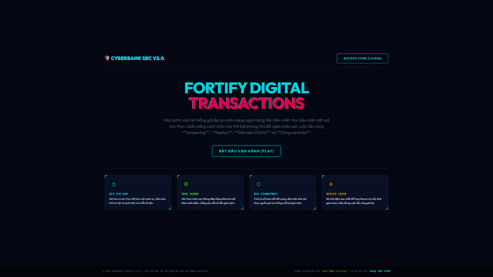

### 2. Màn hình Đăng nhập & Đăng ký (Login & Register)
Hệ thống đăng nhập an toàn kết hợp hiệu ứng neon cyberpunk giúp lưu trữ tiến trình chơi của từng Operator.
| Đăng nhập | Đăng ký |
| :---: | :---: |
| 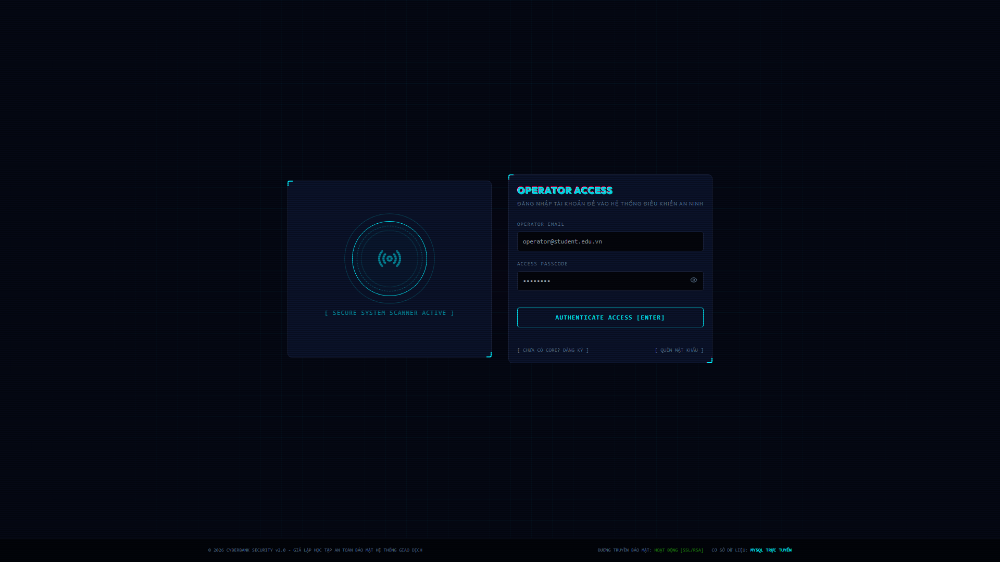 | 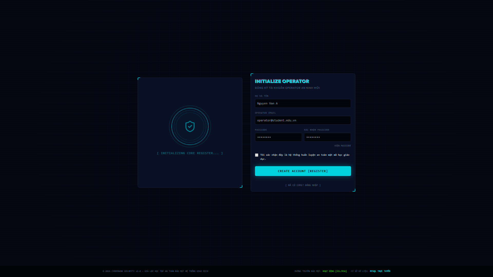 |

### 3. Màn hình Bảng điều khiển (Dashboard & Operator Profile)
Nơi Operator xem cấp bậc của mình (Rank), tổng điểm tích lũy, các huy hiệu thành tựu (achievements) và lựa chọn thay đổi theme màu sắc HUD phù hợp cá nhân (Neon Grid, Matrix Green, Red Alert, Steel HUD).
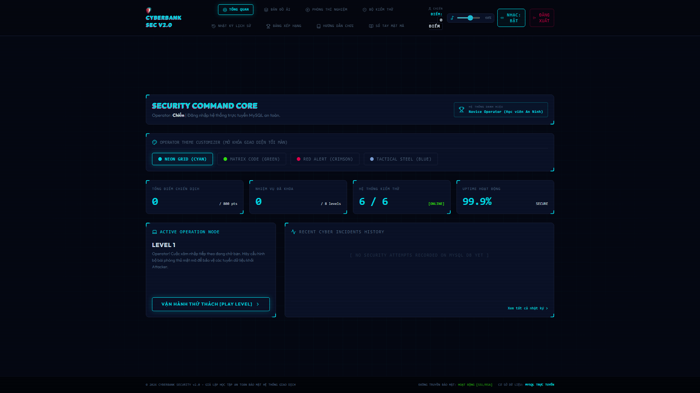

### 4. Sơ đồ Chiến dịch (Campaign Mission Map)
Bản đồ mạng hiển thị 15 màn chơi được xếp theo hình cây thư mục tác chiến, thể hiện trực quan trạng thái khóa/mở khóa màn chơi và số điểm tối đa đạt được.
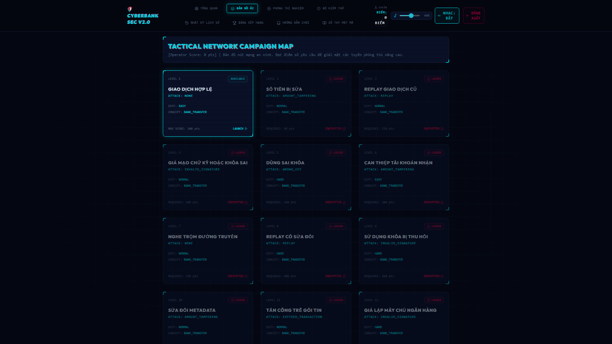

### 5. Giao diện tác chiến trực tiếp (Gameplay Level Operations)
Màn hình chính nơi Operator trực tiếp đọc kịch bản tấn công, phân tích Hex Dump nhấp nháy đỏ báo lỗi chỉnh sửa dữ liệu, lựa chọn các thẻ phòng thủ và theo dõi luồng kiểm tra SVG.
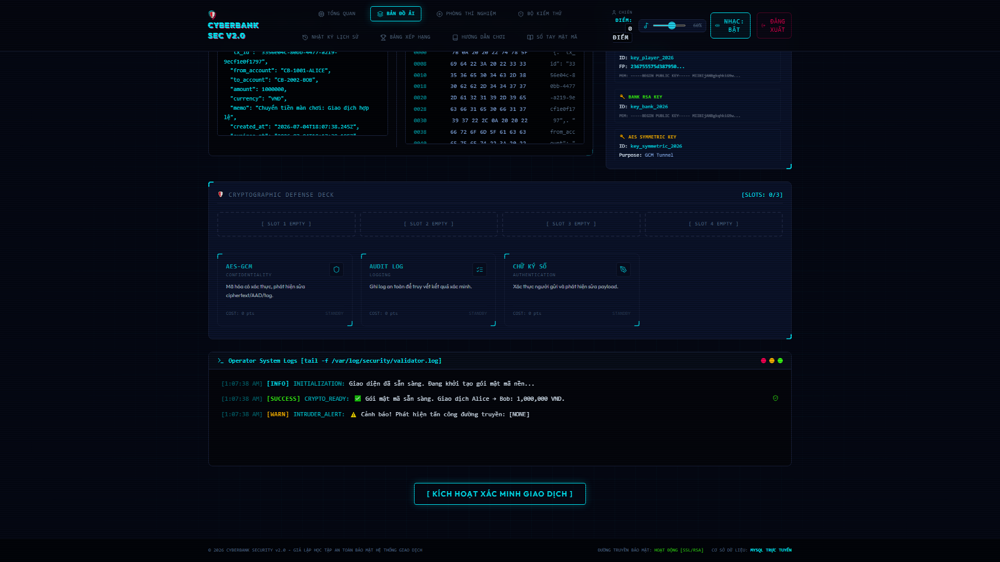

### 6. Phòng thí nghiệm Mật mã (Sandbox Lab)
Giao diện chế độ Sandbox tự do, cho phép Operator lựa chọn bất kỳ kịch bản tấn công nào, trang bị cùng lúc cả 8 thẻ phòng thủ để phân tích chuyên sâu.
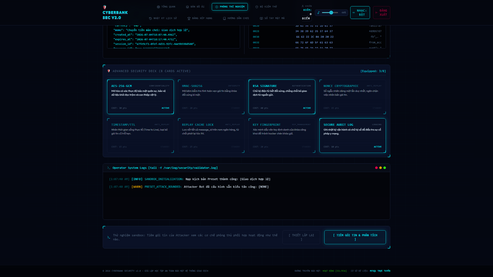

### 7. Trình kiểm tra tuân thủ (Compliance Test Suite)
Màn hình chạy kiểm thử tự động toàn bộ 15 test case bảo mật, xuất báo cáo kiểm định chất lượng an ninh Core Banking.
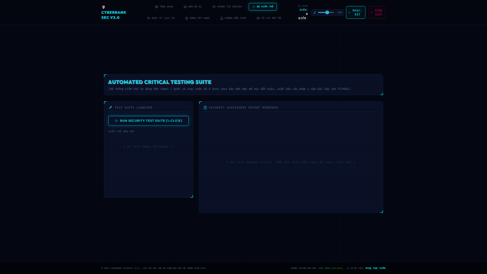

### 8. Lịch sử giao dịch & Nhật ký (History Logs)
Bảng tổng hợp tất cả giao dịch đã thực hiện kèm mã ID phong cách blockchain, cho phép Operator nhấp vào từng lần thử để mở rộng xem chi tiết logs phân cấp.
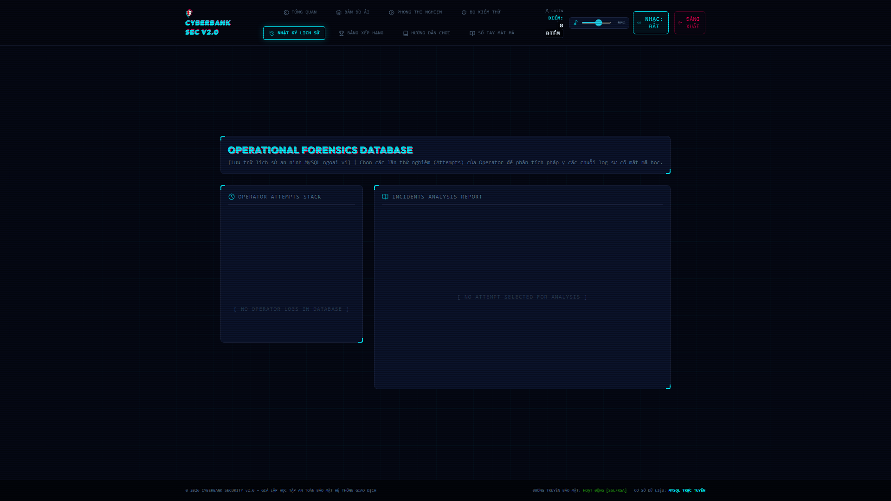

### 9. Thư viện kỹ thuật & Nhật ký Operator (Guide & Notebook)
Trang bị tài liệu huấn luyện Operator chi tiết và cuốn sổ tay giải nghĩa các khái niệm lý thuyết mật mã toán học để học viên tra cứu kiến thức.
| Trung tâm huấn luyện | Sổ tay lý thuyết |
| :---: | :---: |
| 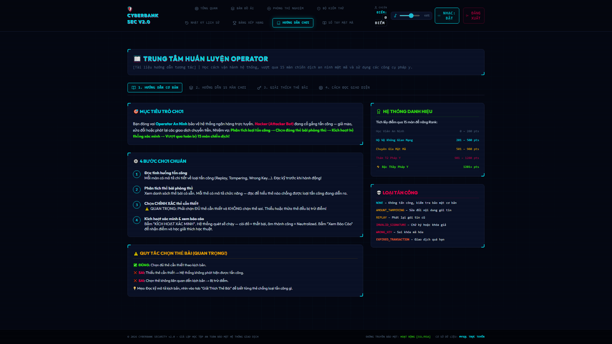 | 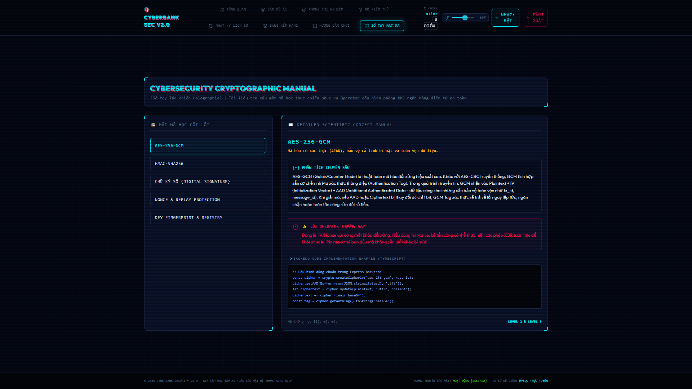 |

---

## 📁 Cấu trúc thư mục dự án

```text
BTL/
├── IMG/                        # Thư mục chứa hình ảnh giao diện & sơ đồ của README.md
├── dist/                       # Thư mục mã nguồn sau khi build biên dịch production
├── src/
│   ├── backend/                # Mã nguồn máy chủ Node.js (Express & Cryptographic Core)
│   │   ├── config/             # Cấu hình kết nối MySQL và script khởi tạo Database
│   │   ├── modules/            # Các module xử lý nghiệp vụ
│   │   │   ├── auth/           # Đăng ký, đăng nhập và phân quyền Operator
│   │   │   ├── crypto/         # Lõi mã hóa đối xứng, bất đối xứng, băm và chữ ký số
│   │   │   ├── game/           # Khởi tạo màn chơi, giả lập Attacker Bot can thiệp dữ liệu
│   │   │   ├── tests/          # Module xử lý chạy Test Suite tự động
│   │   │   └── transactions/   # Validator Service - Pipeline kiểm tra thẻ phòng thủ
│   │   ├── public/             # Thư mục tĩnh chứa React bundle sau khi frontend build
│   │   ├── app.ts              # Express App định nghĩa toàn bộ API Routing
│   │   └── server.ts           # Điểm khởi chạy (Entrypoint) lắng nghe kết nối cổng mạng
│   └── frontend/               # Mã nguồn ứng dụng giao diện React & Vite
│       ├── src/
│       │   ├── components/     # Các UI Component dùng chung (HexViewer, Pipeline SVG, Sound Synth)
│       │   ├── screens/        # Các màn hình chức năng chính (Gameplay, Sandbox, Dashboard,...)
│       │   ├── stores/         # Quản lý State bằng Zustand (Auth & Session State)
│       │   ├── styles/         # Hệ thống định nghĩa màu sắc và hiệu ứng Cyberpunk CSS
│       │   ├── App.tsx         # Component định tuyến điều khiển chính của Frontend
│       │   └── main.tsx        # Điểm khởi chạy của React App
│       ├── package.json        # Dependencies của riêng Frontend (framer-motion, zustand, lucide)
│       └── vite.config.ts      # Cấu hình build của Vite
├── .env.example                # Bản mẫu cấu hình biến môi trường
├── package.json                # Dependencies và Scripts chạy của toàn bộ dự án
└── tsconfig.backend.json       # Cấu hình TypeScript biên dịch cho Backend
```

---
*Dự án được xây dựng và phát triển phục vụ mục đích nghiên cứu, học tập các cơ chế bảo mật mật mã trong giao dịch ngân hàng điện tử.*
