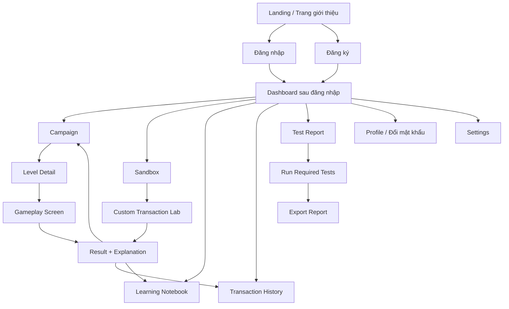

# Thiết kế giao diện - CyberBank Security Game v2

## 1. Mục tiêu giao diện

Giao diện cần được thiết kế như một **Bảng điều khiển tác chiến an ninh mạng tương lai (Cyberpunk Security Operation HUD Console)**. Trọng tâm của giao diện là mang lại trải nghiệm nhập vai (immersive gameplay) chân thực, giúp người chơi có cảm giác như một chuyên gia bảo mật thực thụ hoặc một "hacker mũ trắng" đang vận hành hệ thống chống xâm nhập cho ngân hàng trung ương kỹ thuật số.

Các tiêu chí trải nghiệm cốt lõi bao gồm:
- **Tính nhập vai (Gamified Immersion):** Sử dụng ngôn ngữ đồ họa đậm chất viễn tưởng (Sci-Fi), màu sắc neon tương phản mạnh trên nền cực tối, các widget dạng HUD với góc khung viền `[ ]`, lưới quét bán trong suốt (scanline sweep) và hiệu ứng nhiễu từ kỹ thuật số (glitch effect) siêu nhẹ.
- **Trực quan hóa luồng dữ liệu tự động (Visual Automation):** Tự động mô phỏng bằng hoạt họa chuyển động sinh động khi dữ liệu đi qua luồng mạng. Người chơi có thể nhìn thấy dòng byte dữ liệu chuyển động, chuyển đổi định dạng và bị thay đổi cấu trúc khi đi qua các vùng mạng không an toàn.
- **Trải nghiệm thao tác vượt trội (Tactile Micro-interactions):** Mọi thao tác như chọn thẻ phòng thủ, nhấn nút xác minh, hay đổi tab đều đi kèm hiệu ứng co giãn (spring physics), phát sáng hào quang (neon glow expansion) và phản hồi âm thanh (UI Sound FX) cơ khí tương lai.
- **Tính rõ ràng học thuật:** Dù mang phong cách game nhưng các thông tin khoa học (Hex code, mã băm, chữ ký số, khóa công khai/bí mật) vẫn được hiển thị trực quan và sắc nét, hỗ trợ tối đa việc quay video demo và chấm điểm kiểm thử.

## 1.1 Công nghệ giao diện sử dụng

| Thành phần | Công nghệ | Mục đích trong phong cách Cyberpunk |
|---|---|---|
| Framework | **React 18 + TypeScript** | Xây dựng kiến trúc giao diện website dạng các Widget độc lập |
| Build tool | **Vite 5.x / 6.x** | Tốc độ hot-reload cực nhanh phục vụ tinh chỉnh hiệu ứng |
| Routing | **React Router v6** | Chuyển trang mượt mà kết hợp hiệu ứng trượt màn hình |
| Form & Validation | **React Hook Form + Zod** | Tạo và validate giao dịch demo cực kỳ chặt chẽ trước khi ký |
| UI Styling | **Tailwind CSS + Vanilla CSS** | Tối ưu hóa class tiện ích kết hợp CSS custom keyframes cho hiệu ứng scanline, grid và glow |
| Animation Engine | **Framer Motion** | Tạo các hiệu ứng co giãn (spring dynamics), trượt panel, lật thẻ bài phòng thủ và luồng sáng tự động hóa |
| Graphics & Particle | **HTML5 Canvas API / SVG** | Vẽ sơ đồ luồng tấn công động (Visual Attack Pipeline) và nền ma trận chữ xanh rơi (Matrix Rain Effect) |
| UI Audio | **use-sound (hoặc Web Audio API)** | Phát âm thanh giả lập khi gõ phím cơ, còi cảnh báo lỗi mật mã, và âm thanh click thẻ bài |
| Icon Pack | **Lucide React** | Bộ icon dạng đường viền (stroke) cực kỳ hợp với phong cách HUD viễn tưởng |
| State Management | **Zustand** | Lưu trữ nhẹ và mượt mà trạng thái phiên chơi, điểm số, và lựa chọn thẻ phòng thủ ở thời gian thực |
| Test UI | **Playwright** | Đảm bảo tính năng đăng ký, đăng nhập và luồng chơi chạy ổn định |

Các route chính:

| Route | Loại | Mục đích |
|---|---|---|
| `/` | Public | Trang giới thiệu ngắn và nút vào game |
| `/login` | Public | Đăng nhập |
| `/register` | Public | Đăng ký |
| `/dashboard` | Private | Dashboard sau đăng nhập |
| `/campaign` | Private | Danh sách level |
| `/levels/:levelId` | Private | Màn chơi |
| `/sandbox` | Private | Lab mô phỏng giao dịch |
| `/history` | Private | Lịch sử giao dịch |
| `/notebook` | Private | Kiến thức học thuật |
| `/test-report` | Private | Chạy và xem test report |
| `/profile` | Private | Hồ sơ cá nhân, đổi mật khẩu |
| `/admin` | Admin | Quản lý level/user/report |

## 2. Tham khảo ý tưởng giao diện

- CryptoHack: chia kiến thức theo nhóm challenge, có điểm và tiến độ.
- picoCTF: mỗi thử thách là một bài nhỏ, học bằng cách giải quyết vấn đề.
- CyberStart: có nhiệm vụ, field manual, điểm, leaderboard và hướng dẫn.
- OverTheWire: chuỗi level tăng dần, mở khóa theo tiến độ.

Áp dụng vào CyberBank:

- Dùng **campaign map** để mở khóa level.
- Dùng **challenge card** cho từng nhiệm vụ.
- Dùng **learning drawer** giống field manual để giải thích khái niệm.
- Dùng **scoreboard** và **achievement** để tăng động lực.
- Dùng **terminal/log panel** để người chơi học cách đọc bằng chứng kỹ thuật.

## 3. Sơ đồ điều hướng



## 4. Layout tổng thể

### 4.1 Desktop

Kích thước mục tiêu: 1366x768 trở lên.

```text
+--------------------------------------------------------------------------------+
| Top Bar: Logo | Campaign | Sandbox | Notebook | History | Test Report | Score |
|                                            User Menu: Avatar | Profile | Logout    |
+----------------------+--------------------------------------+------------------+
| Left Panel           | Center Workspace                     | Right Panel      |
| Level/Mission        | Transaction + Defense Builder        | Logs/Inspector   |
| Objectives           | Attack Playback / Result             | Hints/Concepts   |
+----------------------+--------------------------------------+------------------+
| Bottom Bar: status, current session, last saved, benchmark mini info           |
+--------------------------------------------------------------------------------+
```

Tỷ lệ gợi ý:

- Left panel: 260-300px.
- Center workspace: phần còn lại, tối thiểu 620px.
- Right panel: 340-380px.
- Top bar: 64px, có navigation và menu tài khoản.
- Bottom status: 32px.

### 4.2 Tablet

- Left panel chuyển thành drawer.
- Right panel chuyển thành tab `Log`, `Inspector`, `Hint`.
- Center workspace chiếm toàn màn hình.

### 4.3 Mobile

Mobile không phải nền tảng chính, nhưng vẫn nên đọc được:

- Top navigation gọn thành menu.
- Gameplay chia tab:
  - `Nhiệm vụ`
  - `Giao dịch`
  - `Phòng thủ`
  - `Log`
  - `Kết quả`
- Defense cards hiển thị dạng danh sách 1 cột.

## 5. Design tokens (Hệ thống Nhận diện Hacker HUD)

| Token | Giá trị Cyberpunk | Ý nghĩa & Ứng dụng thực tế |
|---|---|---|
| `color-bg` | `#050814` | Nền tối tuyệt đối (Deep Space Dark), giảm mỏi mắt, tăng độ sâu |
| `color-surface` | `#0b132b` | Nền của các widget/card (Cyber Navy), tạo chiều sâu 3D |
| `color-border` | `#1c2541` | Viền góc cạnh của hộp HUD, tạo ranh giới công nghệ |
| `color-text` | `#e2f1ff` | Chữ chính (Ice White), tương phản cao, dễ đọc trên nền tối |
| `color-muted` | `#5a738e` | Chữ phụ/chú thích (Steek Gray), mờ nhưng không chìm |
| `color-neon-cyan` | `#00f0ff` | Xanh Neon Cyan (Cyber Security) - Khóa, chữ ký, bảo mật, trang bị |
| `color-neon-green` | `#39ff14` | Xanh Cyber Green (Safe/Valid) - Giao dịch thành công, bypass, qua màn |
| `color-neon-pink` | `#ff0055` | Hồng Neon Pink/Red (Infiltration) - Attacker bot, giả mạo, lỗi, nguy hại |
| `color-neon-amber` | `#ffb700` | Vàng Neon Amber (Warning) - Giao dịch replay, cảnh báo, gợi ý, hết hạn |
| `color-terminal` | `#04060c` | Nền bảng mã/console (Absolute Black), giống terminal linux |
| `radius-card` | `10px` | Bo góc nhẹ của widget, tạo sự tinh tế |
| `radius-control` | `4px` | Bo góc điều khiển góc cạnh, mang phong cách Sci-Fi quân sự |
| `font-ui` | `'Outfit', 'Inter', sans-serif` | Phông chữ UI hình học hiện đại, sắc nét |
| `font-code` | `'JetBrains Mono', monospace` | Phông chữ cho gói tin giao dịch và log chuyên dụng |

### 5.1 Hiệu ứng Thị giác Đặc biệt (CSS Classes & Animation)
- **`effect-scanlines`:** Lớp phủ kẻ sọc ngang mờ chuyển động chậm, tạo cảm giác màn hình CRT máy tính cổ điển.
- **`effect-grid`:** Nền lưới tọa độ vector bán trong suốt xoáy nhẹ ở tâm để tạo chiều sâu 3D HUD.
- **`effect-cyber-glow`:** Hiệu ứng phát bóng neon tỏa rộng (`box-shadow: 0 0 15px var(--neon-cyan)`) áp dụng cho các thẻ bài được chọn.
- **`effect-text-glitch`:** Hoạt họa rung nháy tách lớp màu RGB đỏ-xanh khi có sự kiện tấn công (TAMPERING).

### 5.2 Hiệu ứng Âm thanh Hệ thống (UI Sound FX)
- **`sound-keystroke`:** Tiếng click phím cơ Blue Switch khi người chơi nhập số tiền giao dịch.
- **`sound-card-slide`:** Tiếng lướt cơ khí khi kéo/thả hoặc kích hoạt thẻ phòng thủ.
- **`sound-alarm-loop`:** Tiếng bíp tần số thấp nhấp nháy liên hồi khi phát hiện tấn công Replay.
- **`sound-decryption-success`:** Tiếng chuông cộng hưởng công nghệ cao khi xác minh chữ ký thành công.
- **`sound-ambient-hum`:** Tiếng ù nền điện tử nhẹ nhàng (Sci-fi generator hum) tạo không gian phòng lab.

## 6. Thành phần giao diện chính (Gamified Widgets)

| Component | Mục đích | Trực quan hóa & Hiệu ứng Cyber |
|---|---|---|
| `TopNavigation` | Điều hướng, tổng điểm, trạng thái pin/uptime giả lập | Chữ số dạng đồng hồ LED phát sáng, nháy nhẹ nhịp tim |
| `AuthLayout` | Khung đăng nhập phong cách khóa sinh học | Khung HUD quét võng mạc vân tay bằng tia sáng xanh chạy dọc |
| `LoginForm`/`RegisterForm` | Form bảo mật, password strength indicator | Vạch pin năng lượng phát sáng tăng dần từ đỏ đến xanh lá |
| `MatrixBackground` | Nền ma trận ký tự chạy rơi (Matrix Rain) | Canvas vẽ chữ rơi nhạt dần phía sau trang login để gây ấn tượng |
| `CampaignGridMap` | Lộ trình level dạng sơ đồ mạng (Network Nodes) | Các node level nối với nhau bằng các luồng sáng (laser beams) chảy xiết |
| `LevelNodeCard` | Thử thách an ninh với badge chỉ số độ khó | Glowing ring (vòng tròn phát sáng) xoay tròn xung quanh node đang mở |
| `VisualAttackPipeline` | Trực quan hóa dòng chảy giao dịch tự động | Hạt photon dữ liệu trượt từ Client (Cyan) -> Attacker (Pink) -> Server |
| `HexMatrixViewer` | Bảng kết xuất Hex code thô của giao dịch | Hiển thị song song dạng text/hex, các byte bị sửa sẽ nhấp nháy đỏ rực |
| `CyberDefenseDeck` | Kho thẻ bài phòng thủ dạng bài ma thuật | Thẻ bài 3D tương tác, zoom/lật mặt, phát neon khi kéo thả vào slot |
| `DefenseSlotBuilder` | Vùng lắp ghép cấu hình phòng thủ | 4 cổng cắm (slots) cơ khí hình lục giác phát sáng chờ gắn thẻ bài |
| `LaserScanSweep` | Hoạt họa quét laser xác minh | Tia laser đỏ quét dọc từ trên xuống gói tin khi bắt đầu "Verify" |
| `KeyDecryptionRing` | Mô phỏng khớp khóa chữ ký số | 2 vòng tròn bánh răng khóa mật mã xoay ngược chiều, khớp nhau sẽ phát tia lửa |
| `TerminalLogConsole` | Console in log hệ thống typewriter | Hiển thị log dạng gõ chữ chạy, tự động cuộn (auto-scroll) mượt mà |
| `ExplanationDialog` | Hộp thoại bài học, giải thích nguyên nhân | Thiết kế như báo cáo pháp y mạng (Cyber Forensics Report) với sơ đồ phân tích |
| `LearningDrawer` | Sổ tay ghi chép an ninh (Cyber Field Manual) | Sidebar kéo trượt dạng Holographic chứa tài liệu giải thích concept |
| `TestReportConsole` | Giao diện chạy kiểm thử tự động | Giao diện như máy quét virus chạy tự động kiểm tra từng test case |

## 7. Màn hình chính

### 7.1 Nội dung

Website có một landing page ngắn cho khách chưa đăng nhập, sau đó chuyển vào dashboard khi đăng nhập thành công.

Landing page chỉ cần:

- Tên game: CyberBank Security Game v2.
- Một câu mô tả: game mô phỏng bảo mật giao dịch ngân hàng.
- Nút `Đăng nhập`.
- Nút `Đăng ký`.
- Link xem nhanh các khái niệm: mã hóa, chữ ký số, replay attack.

Không làm landing page quá dài; trọng tâm sản phẩm là website game.

Dashboard sau đăng nhập là màn hình chính thật sự. Người dùng vào game là thấy ngay:

- Tiến độ campaign.
- Nút tiếp tục level hiện tại.
- Tổng điểm.
- Test bắt buộc đã pass bao nhiêu.
- Giao dịch/log gần nhất.
- Lối vào sandbox và learning notebook.
- Avatar/tên người dùng và nút đăng xuất.

### 7.2 Bố cục

```text
+--------------------------------------------------------------------------------+
| CyberBank Security Game v2                                      Score: 420/800 |
| Xin chào, Nguyen Van A                                      Profile | Logout |
+--------------------------------------------------------------------------------+
| Continue Mission: Level 3 - Replay Attack                                       |
| [Play] [Open Sandbox] [Run Required Tests]                                      |
+-------------------------------+----------------------+-------------------------+
| Campaign Progress             | Recent Transactions  | Learning Notebook       |
| L1 completed                  | tx_001 accepted      | AES-GCM unlocked        |
| L2 completed                  | tx_002 rejected      | Digital Signature       |
| L3 available                  | tx_003 replay        | Replay Protection       |
+-------------------------------+----------------------+-------------------------+
```

### 7.3 Hành động

- `Play`: vào level tiếp theo.
- `Open Sandbox`: thử giao dịch tùy chỉnh.
- `Run Required Tests`: chạy test phục vụ báo cáo.
- `View History`: xem log và giao dịch.

## 7.4 Màn đăng ký

Mục tiêu: tạo tài khoản người chơi để lưu tiến độ trong MySQL.

Form đăng ký gồm:

| Field | Bắt buộc | Validate |
|---|---|---|
| Họ tên | Có | 2-100 ký tự |
| Email | Có | Đúng định dạng email, không trùng |
| Mật khẩu | Có | Tối thiểu 8 ký tự |
| Xác nhận mật khẩu | Có | Phải khớp mật khẩu |
| Đồng ý điều khoản demo | Có | Checkbox |

Bố cục:

```text
+--------------------------------------------------+
| CyberBank Security Game v2                       |
| Tạo tài khoản người chơi                         |
|                                                  |
| Họ tên                                           |
| [________________________________]               |
| Email                                            |
| [________________________________]               |
| Mật khẩu                                         |
| [___________________________] [eye]              |
| Xác nhận mật khẩu                                |
| [___________________________] [eye]              |
| [x] Tôi hiểu đây là hệ thống mô phỏng giáo dục   |
|                                                  |
| [Đăng ký]                                        |
| Đã có tài khoản? Đăng nhập                       |
+--------------------------------------------------+
```

Trạng thái cần có:

- Loading khi gửi form.
- Lỗi email đã tồn tại.
- Lỗi mật khẩu yếu.
- Lỗi xác nhận mật khẩu không khớp.
- Thành công thì chuyển vào dashboard hoặc màn đăng nhập.

## 7.5 Màn đăng nhập

Form đăng nhập gồm:

| Field | Bắt buộc | Validate |
|---|---|---|
| Email | Có | Đúng định dạng |
| Mật khẩu | Có | Không rỗng |
| Ghi nhớ đăng nhập | Không | Checkbox |

Bố cục:

```text
+--------------------------------------------------+
| CyberBank Security Game v2                       |
| Đăng nhập để tiếp tục nhiệm vụ bảo mật           |
|                                                  |
| Email                                            |
| [________________________________]               |
| Mật khẩu                                         |
| [___________________________] [eye]              |
| [ ] Ghi nhớ đăng nhập                            |
|                                                  |
| [Đăng nhập]                                      |
| Chưa có tài khoản? Đăng ký                       |
| Quên mật khẩu?                                   |
+--------------------------------------------------+
```

Thông báo lỗi:

- `Email hoặc mật khẩu không đúng.`
- `Tài khoản đã bị khóa. Vui lòng liên hệ quản trị viên.`
- `Phiên đăng nhập đã hết hạn. Vui lòng đăng nhập lại.`

Không hiển thị lỗi quá chi tiết như "email đúng nhưng mật khẩu sai".

## 7.6 Màn hồ sơ cá nhân

Chức năng:

- Xem họ tên, email, role, ngày tạo tài khoản.
- Xem tổng điểm, level đã hoàn thành, achievement.
- Đổi mật khẩu.
- Đăng xuất khỏi tất cả thiết bị.

Form đổi mật khẩu:

| Field | Validate |
|---|---|
| Mật khẩu hiện tại | Không rỗng |
| Mật khẩu mới | Tối thiểu 8 ký tự |
| Xác nhận mật khẩu mới | Phải khớp |

Lưu ý UI:

- Không hiển thị password hash.
- Không hiển thị token.
- Khi đổi mật khẩu thành công, nên thu hồi refresh token cũ.

## 8. Campaign Map

Mục tiêu: cho người chơi thấy lộ trình học.

Card level cần có:

- Số level.
- Tên level.
- Concept chính.
- Loại attack.
- Điểm tối đa.
- Trạng thái: khóa, đang mở, đã hoàn thành, perfect.
- Số lần thử.

Danh sách level đề xuất:

| Level | Tên hiển thị | Badge | Màu trạng thái |
|---|---|---|---|
| 1 | Giao dịch hợp lệ | Valid Flow | Xanh success |
| 2 | Số tiền bị sửa | Tampering | Cam warning |
| 3 | Replay giao dịch cũ | Replay | Đỏ danger |
| 4 | Chữ ký giả | Signature | Xanh security |
| 5 | Dùng sai khóa | Wrong Key | Cam warning |
| 6 | Giao dịch hết hạn | TTL | Tím nhạt hoặc xanh phụ |
| 7 | Dùng lại nonce | Nonce Reuse | Đỏ danger |
| 8 | Điều tra log | Forensics | Xám/blue |

## 9. Gameplay Screen (Màn hình Tác chiến / Trung tâm điều khiển)

Đây là màn hình cốt lõi của game, nơi người chơi tương tác trực tiếp với các cơ chế mật mã học để chặn đứng Attacker Bot. Giao diện được tổ chức theo phong cách **Sci-Fi Tactical HUD**.

### 9.1 Bố cục HUD Desktop (1440x1024)

```text
+--------------------------------------------------------------------------------------------------+
| Top: [CB_SYSTEM_V2.0] | CAMPAIGN MAP | SANDBOX LAB | HISTORY | MANUAL | [SCORE: 000420] [UPTIME: 99%] |
+------------------------+------------------------------------------------------+------------------+
| LEFT PANEL (Mission)   | CENTER CORE (Network & Sandbox Workspace)             | RIGHT PANEL      |
|                        | +--------------------------------------------------+ | (Cyber Inspector)|
| > CODENAME:            | | Visual Attack Pipeline (Photon flow animation)   | |                  |
|   Amount_Tamper_02     | +--------------------------------------------------+ | > HEX MATRIX DUMP|
| > TARGET ASSET:        | | Hex/Binary Matrix Viewer (Flash red on modify)   | |   [00 1F AA CD]  |
|   VND Amount Integrity | +--------------------------------------------------+ |                  |
| > THREAT LEVEL:        | | Cyber Defense Slots (Hexagonal grid drop zones)  | | > SIGNATURE RING |
|   High                 | +--------------------------------------------------+ |   [UNVERIFIED]   |
| > MISSION BRIEF:       | | Cyber Defense Deck (Interactable drag cards)     | |                  |
|   Deploy signature to  | +--------------------------------------------------+ | > KEY MATRIX     |
|   detect payload       | | [ACTIVATE VERIFICATION PIPELINE] (Verify Button) | |   [FINGERPRINT]  |
|   alterations.         | +--------------------------------------------------+ |                  |
+------------------------+------------------------------------------------------+------------------+
| BOTTOM TERMINAL: [root@cyberbank]# tail -f /var/log/security/validator.log                        |
| 14:30:05 [INFO] SESSION_INITIALIZED (Hash: 9a2f...) | 14:30:10 [WARN] TAMPER_DETECTED (Amount modified)  |
+--------------------------------------------------------------------------------------------------+
```

### 9.2 Vùng Left Panel - Mission Briefing (Pháp y & Nhiệm vụ)
- **Thiết kế đồ họa:** Sử dụng khung HUD bo góc bằng các ký hiệu `[ ]`, tiêu đề nhiệm vụ hiển thị dưới dạng chữ điện tử nhấp nháy liên tục (glitch text) màu Neon Amber khi chưa hoàn thành.
- **Nội dung:**
  - **Codename:** Mã danh thử thách (ví dụ: `SEC_L3_REPLAY_INTRUDER`).
  - **Mission Briefing:** Mô tả tình huống dưới dạng nhật ký sự cố an ninh (Security Incident Report) đầy hấp dẫn.
  - **Winning Conditions:** Các mục tiêu cần bật đèn xanh lá (`Cyber Green`) để qua màn.

### 9.3 Vùng Center Workspace - Transaction Workspace (Trung tâm Điều khiển Luồng)
Vùng này chứa 4 thành phần hoạt họa đỉnh cao:

1. **Visual Attack Pipeline (Sơ đồ luồng mạng Photon):**
   - **Hoạt họa:** Một bản vẽ SVG/Canvas biểu diễn 3 nút mạng: **[CLIENT NODE]** --(cáp quang)-- **[ATTACKER BUFFER]** --(cáp quang)-- **[BANK VALIDATOR]**.
   - **Hiệu ứng tự động hóa:** Các hạt ánh sáng photon mang dữ liệu màu `Neon Cyan` liên tục trượt từ trái sang phải. 
     - Khi đi qua nút **[ATTACKER BUFFER]**, nếu Attacker tấn công (ví dụ: Level 2 - Tampering), hạt photon lập tức bị nổ tung và hóa thành cụm đám mây photon màu `Neon Pink` hỗn loạn, thể hiện dữ liệu đã bị biến đổi cấu trúc.
     - Dòng photon màu hồng này tiếp tục chảy đến **[BANK VALIDATOR]**. Khi Validator quét qua, nếu người chơi cấu hình phòng thủ sai, photon hồng sẽ xâm nhập vào cơ sở dữ liệu làm còi báo động đỏ nháy sáng. Nếu cấu hình đúng, Validator sẽ dựng lên một tấm khiên năng lượng màu `Neon Cyan` chặn đứng photon hồng, đẩy lùi nó ra ngoài.

2. **Hex/Binary Matrix Viewer (Bảng phân tích thô):**
   - **Hoạt họa:** Hiển thị song song bảng JSON giao dịch bên trái và mã Hex thô (Hex dump) bên phải.
   - **Hiệu ứng tự động hóa:** Khi dòng photon bị Attacker Bot bóp méo, toàn bộ các byte Hex đại diện cho trường bị sửa (ví dụ: `amount` từ `01 00 00` thành `64 00 00`) sẽ nhấp nháy đỏ rực rỡ và có hiệu ứng phóng to giật giật (pulsing glitch) để người chơi dễ dàng định vị vị trí dữ liệu bị sửa đổi.

3. **Cyber Defense Deck (Bộ bài Phòng thủ Mật mã):**
   - **Hoạt họa:** Danh sách các giải pháp phòng thủ được thiết kế như những **Thẻ bài ma thuật 3D (Holocard)**. 
   - **Hiệu ứng:** 
     - Khi di chuột (hover) qua thẻ bài, thẻ bài sẽ hơi nghiêng theo góc nhìn 3D (parallax tilt), phát sáng viền hào quang neon tương ứng với thuộc tính của nó và phát âm thanh cơ khí trượt nhẹ (`sound-card-slide`).
     - Khi kéo (drag), thẻ bài biến thành dạng bán trong suốt dạng ảnh ảo (hologram). Khi đặt (drop) vào khe cắm hình lục giác `Defense Slot Builder`, thẻ bài sẽ tự động bắt khớp vào khe với hiệu ứng từ tính co giãn (spring snap animation) kèm tiếng nổ điện nhỏ (`sound-card-snap`).

4. **Nút "ACTIVATE VERIFICATION PIPELINE" (Xác minh Tự động):**
   - Thiết kế như nút bấm hạt nhân màu đỏ có khung che bảo vệ. Nhấp chuột vào nút sẽ phát tiếng click phím cơ đanh thép (`sound-keystroke`).

### 9.4 Vùng Right Panel - Crypto Inspector
- **Hoạt họa:** Hiển thị trạng thái phân tích chuyên sâu các thành phần mật mã học:
  - **Signature Matching Ring:** Hai vòng răng cưa laser hiển thị trạng thái khớp chữ ký. Nếu chữ ký không khớp, vòng răng cưa quay ngược chiều nhau và nhấp nháy đỏ kèm ký hiệu `[SIGNATURE_INVALID]`. Nếu khớp, chúng khóa lại thành một thể thống nhất màu xanh lá.
  - **Decryption Key Registry:** Hiển thị dấu vân tay khóa (Key Fingerprint) dạng đồ họa barcode hoặc QR Code nhỏ nhấp nháy xanh lá nếu khớp `key_id`, hoặc xám xịt nếu sai khóa.

## 10. Result + Cyber Forensics Report (Kết quả & Báo cáo Pháp y)

Sau khi hệ thống hoàn tất quá trình quét laser xác minh tự động, một bảng **Báo cáo Pháp y Mạng (Cyber Forensics Report)** sẽ trượt lên từ phía dưới màn hình (Slide-up Panel) thay vì modal che mắt thông thường.

### 10.1 Khi Chặn đứng Tấn công Thành công (SUCCESS STATE)
- **Hiệu ứng:** Toàn bộ viền màn hình nháy sáng xanh lá mượt mà (`Neon Green`), phát âm thanh double-chime thành tựu (`sound-decryption-success`).
- **Nội dung:**
  - Tiêu đề: `[INTRUSION_BLOCKED] - THREAT NEUTRALIZED` (Màu xanh neon).
  - Điểm số: Hiển thị thanh chạy điểm số tự động đếm tăng dần từ `0` đến điểm thực tế (ví dụ: `+95 pts`) dạng ma trận.
  - Bằng chứng pháp y (Forensic Evidence): Trích xuất dòng log mấu chốt chứng minh vì sao chặn được (ví dụ: `14:31:02 [SECURITY] AEAD_TAG_VALID - Payload integrity verified`).
  - Nút chuyển tiếp: `[INITIATE_NEXT_MISSION]` (Phát sáng màu Cyan, hover có hiệu ứng nhiễu sóng).

### 10.2 Khi Tấn công Vượt qua Phòng thủ (FAILED STATE)
- **Hiệu ứng:** Màn hình nhấp nháy viền màu đỏ neon (`Neon Pink`), còi báo động kêu dồn dập, các widget hơi rung lắc nhẹ mô phỏng hệ thống ngân hàng bị hack.
- **Nội dung:**
  - Tiêu đề: `[SYSTEM_COMPROMISED] - DATA TAMPERED` (Màu đỏ neon).
  - Điểm số: Hiển thị `-20 pts` nhấp nháy.
  - Phân tích lỗ hổng: Chỉ ra chính xác lỗ hổng bị khai thác dưới dạng biểu đồ phân tích lỗi mật mã (cryptographic breakdown diagram).
  - Nút thử lại: `[RE-BOOT SYSTEM & RETRY]` (Nút màu đỏ quét sóng liên tục).

## 11. Crypto Inspector (Bảng Phân tích Mật mã Chuyên sâu)

Bảng phân tích này giúp sinh viên mổ xẻ cấu trúc kỹ thuật của envelope dữ liệu gửi đi:
- **Canonical Payload Tab:** Hiển thị JSON được chuẩn hóa dòng, các dấu cách thừa bị loại bỏ, sử dụng font JetBrains Mono sắc nét.
- **AEAD Decryption Monitor:** Thể hiện trực quan cách AES-GCM tách dòng dữ liệu thành: `Ciphertext` + `Associated Data (AAD)` + `Authentication Tag`. Nếu sai khóa giải mã, thẻ `Tag` sẽ nhấp nháy đỏ kèm hiệu ứng nhiễu hạt `[TAG_INTEGRITY_FAILED]`.
- **Key Rotation Tracker:** Hiển thị sơ đồ xoay khóa thời gian thực, đối chiếu khóa công khai của người gửi với kho khóa công khai được lưu tại Bank Validator.

## 12. Terminal Log Console (Cửa sổ Dòng lệnh & Nhật ký)

Thiết kế mô phỏng 100% terminal dòng lệnh Linux tối giản nhưng trực quan cực cao.

### 12.1 Cơ chế hoạt động của Log:
- **Hiệu ứng chữ chạy tự động (Typewriter Automation):** Khi Validator chạy xác minh, các dòng log không xuất hiện ngay lập tức mà được gõ ra màn hình với tốc độ cực nhanh kèm âm thanh lách cách của phím cơ cổ điển (`sound-typewriter`).
- **Tự động cuộn thông minh (Auto-Scroll with smooth friction):** Tự động bám sát dòng log mới nhất nhưng cho phép người chơi cuộn ngược lại để tra cứu bằng chứng.

### 12.2 Phân cấp màu sắc theo mức độ nghiêm trọng (Severity Neon):
- `[INFO]`: Màu xanh dương nhạt (`#00f0ff` Cyan). Dùng cho luồng chạy thông thường.
- `[WARN]`: Màu vàng Amber (`#ffb700`). Dùng cho các hành động của Attacker Bot.
- `[ERROR]`: Màu hồng Neon (`#ff0055`). Dùng cho lỗi hệ thống hoặc sai cấu hình thông thường.
- `[SECURITY]`: Màu đỏ rực. Dùng cho các sự kiện phát hiện gian lận nghiêm trọng như Replay phát hiện hay Sai chữ ký số.
- `[SUCCESS]`: Màu xanh Cyber Green (`#39ff14`). Chấp nhận giao dịch an toàn.

### 12.3 Tương tác chọn bằng chứng (Log Forensics Mission):
- Ở một số level nâng cao (ví dụ: Level 8 - Forensics), người chơi được yêu cầu điều tra log. Người chơi có thể di chuột qua từng dòng log. Dòng log sẽ sáng lên viền xanh, bấm chọn dòng log đúng chứa bằng chứng tấn công (ví dụ: dòng log ghi nhận `REPLAY_DETECTED`) sẽ tự động trích xuất bằng chứng sang hộp nhiệm vụ, cộng ngay `+5 pts` bonus.
- ERROR: đỏ.
- SECURITY: xanh security hoặc đỏ tùy mức.
- SUCCESS: xanh.

## 13. Transaction History

Màn lịch sử gồm:

- Bảng giao dịch.
- Trạng thái: accepted/rejected.
- Attack type.
- Defense đã chọn.
- Điểm.
- Link xem chi tiết attempt.
- Export CSV/Markdown cho báo cáo.

Cột đề xuất:

| Cột | Ví dụ |
|---|---|
| Time | 2026-05-18 14:30 |
| Level | L2 - Số tiền bị sửa |
| Tx ID | tx_002 |
| Amount | 1.000.000 -> 100.000.000 |
| Attack | Amount Tampering |
| Result | Rejected |
| Score | +85 |
| Evidence | SIGNATURE_INVALID |

## 14. Sandbox Screen

Sandbox giúp demo tự do.

Panel cấu hình:

- From account.
- To account.
- Amount.
- Currency.
- Memo.
- Algorithm:
  - AES-GCM on/off.
  - HMAC on/off.
  - Digital signature on/off.
  - Nonce on/off.
  - Timestamp on/off.
  - Replay cache on/off.
- Attack:
  - None.
  - Modify amount.
  - Modify receiver.
  - Replay.
  - Invalid signature.
  - Wrong key.
  - Expired timestamp.
  - Nonce reuse.

Kết quả:

- Accepted/Rejected.
- Log.
- Explanation.
- Score grade.

## 15. Learning Notebook

Màn học thuật ngắn, không thay thế báo cáo nhưng đủ để game đáp ứng yêu cầu.

Mỗi concept có:

- Tên.
- Mô tả 3-5 câu.
- Ví dụ trong game.
- Lỗi thường gặp.
- Level liên quan.
- Link tham khảo hoặc ghi chú tài liệu môn học.

Concept bắt buộc:

- AES-GCM.
- Hash.
- HMAC.
- Digital Signature.
- RSA/ECDSA/Ed25519.
- Nonce.
- Timestamp.
- Replay Attack.
- Key Management.
- Audit Log.

## 16. Test Report Screen

Dành cho sản phẩm nộp.

Tính năng:

- Nút `Run Required Tests`.
- Bảng kết quả test.
- Thời gian chạy.
- Log rút gọn.
- Nút export Markdown.

Test bắt buộc:

| Test | Expected | UI status |
|---|---|---|
| Valid transaction | Accepted | Pass |
| Amount tampering | Rejected | Pass |
| Replay old transaction | Rejected | Pass |
| Invalid signature | Rejected | Pass |
| Wrong key | Rejected | Pass |
| Score and explanation | Correct | Pass |

## 17. Trực quan hóa UI/UX chi tiết cho từng Màn chơi

Mỗi level được thiết kế với kịch bản hoạt họa và âm thanh tự động riêng biệt, giúp trực quan hóa hoàn toàn khái niệm mật mã học trừu tượng.

### Level 1: Giao dịch hợp lệ (The Perfect Flow)
- **Kịch bản Trực quan:**
  - Khi nhấn *ACTIVATE*, một chùm hạt ánh sáng Neon Cyan (giao dịch gốc) trượt mượt mà qua cáp quang mạng.
  - Attacker Bot hiển thị trạng thái ngủ yên (IDLE). Dòng photon Cyan đi qua an toàn.
  - Tia laser xanh lục (`Neon Green`) quét dọc gói tin.
  - **Key Decryption Ring** xoay 360 độ và khớp chặt khít với một tiếng click cơ khí giòn giã (`sound-decryption-success`).
  - Đèn chỉ báo `[SIGNATURE_VALID]` bừng sáng.
- **Console Log:**
  - Chạy chữ typewriter: `[INFO] VALIDATION_STARTED -- Quét dữ liệu giao dịch...`
  - `[SUCCESS] SIGNATURE_VALID -- Chữ ký số khớp khóa công khai.`
  - `[SUCCESS] TRANSACTION_ACCEPTED -- Cộng +100 điểm.`

### Level 2: Số tiền bị sửa (The Tamper Alert)
- **Kịch bản Trực quan:**
  - Luồng hạt photon Neon Cyan đi từ Client.
  - Khi đi qua **Attacker Buffer**, Attacker Bot mở mắt đỏ, phóng tia chớp màu hồng giật mạnh dòng dữ liệu. 
  - Tại bảng **Hex Matrix Viewer**, byte giá trị số tiền nhấp nháy đỏ rực rỡ và liên tục biến dạng (glitch effect) từ `01 00 00` (1.000.000) thành `64 00 00` (100.000.000).
  - Giao dịch bị bóp méo màu hồng chạy tiếp đến Bank Validator.
  - Tia laser quét dọc, quét đến trường `Amount` thì lập tức dừng lại, phát tiếng bíp lỗi chói tai (`sound-alarm-loop`).
  - **Signature Matching Ring** quay loạn nhịp, tách đôi làm hai nửa và nứt vỡ ra.
- **Console Log:**
  - `[WARN] ATTACK_APPLIED -- Attacker can thiệp sửa số tiền thành 100.000.000 VND!`
  - `[SECURITY] PAYLOAD_HASH_MISMATCH -- Hash tính toán lại không khớp chữ ký số!`
  - `[ERROR] TRANSACTION_REJECTED -- Từ chối xử lý giao dịch. Tampering chặn đứng!`

### Level 3: Replay giao dịch cũ (The Ghost Packet)
- **Kịch bản Trực quan:**
  - Người chơi nhìn thấy một giao dịch hợp lệ cũ đã được xử lý ( photon Cyan đã nằm im trong cơ sở dữ liệu ngân hàng).
  - Đột nhiên, Attacker Bot rút ra một khẩu súng quét dữ liệu, "sao chép" (clone) chùm photon cũ và bắn chùm photon nhân bản (màu vàng Amber phản quang) chạy vào mạng.
  - Chùm photon này có chữ ký hoàn toàn hợp lệ, làm hệ thống ban đầu tưởng nhầm là đúng người gửi.
  - Khi chùm photon Amber tới Bank Validator, tia laser xanh quét qua chữ ký báo `Signature Valid` (vòng tròn chữ ký khớp xanh lá).
  - Tuy nhiên, Validator tiếp tục quét đến khe **Replay Cache**. Một luồng sáng quét radar hình quạt màu Amber quét nhanh và phát tiếng kêu "cộc cộc" cảnh báo: `message_id: msg_001` đã tồn tại trong bộ nhớ đệm!
  - Lá chắn lửa chặn đứng chùm photon Amber, phân rã nó thành các mảnh vụn kỹ thuật số màu xám.
- **Console Log:**
  - `[WARN] ATTACK_APPLIED -- Phát hiện gói tin trùng lặp gửi lại từ mạng nội bộ.`
  - `[SECURITY] REPLAY_DETECTED -- msg_001 đã được xử lý trong Replay Cache!`
  - `[ERROR] TRANSACTION_REJECTED -- Chặn đứng replay attack thành công!`

### Level 4: Giả mạo chữ ký (The Spooked Key)
- **Kịch bản Trực quan:**
  - Attacker tạo một giao dịch giả mạo chuyển tiền từ tài khoản nạn nhân và ký bằng một khóa bí mật giả mạo (Attacker Private Key).
  - Chùm photon mang màu hồng Neon di chuyển đến Bank Validator.
  - Tia laser đỏ quét dọc từ trên xuống.
  - Tại **Key Fingerprint Registry**, barcode khóa của giao dịch được quét hồng ngoại và đối chiếu với barcode của khách hàng đăng ký trên cơ sở dữ liệu ngân hàng.
  - Hai barcode trượt đè lên nhau nhưng các vạch kẻ lệch hoàn toàn, lập tức nhấp nháy đỏ rực và hiện chữ `FINGERPRINT_MISMATCH`.
  - **Signature Matching Ring** phát tiếng nổ glitch giật màn hình mạnh mẽ.
- **Console Log:**
  - `[WARN] ATTACK_APPLIED -- Nhận yêu cầu giao dịch giả mạo chữ ký.`
  - `[SECURITY] KEY_FINGERPRINT_INVALID -- Fingerprint khóa ký không trùng khớp với chủ tài khoản!`
  - `[ERROR] TRANSACTION_REJECTED -- Chữ ký giả mạo bị loại bỏ!`

## 18. Trạng thái lỗi và thông báo

Thông báo cần rõ nhưng không lộ secret.

| Lỗi | Thông báo cho người chơi |
|---|---|
| Sai chữ ký | Chữ ký không xác minh được với public key đã đăng ký |
| Sai khóa | Không thể xác thực tag hoặc key_id không khớp |
| Replay | Message này đã được xử lý trong phiên hiện tại |
| Hết hạn | Timestamp nằm ngoài thời gian cho phép |
| Thiếu defense | Cấu hình chưa có cơ chế kiểm tra toàn vẹn |
| Input sai | Số tiền phải lớn hơn 0 và không vượt hạn mức demo |

Không hiển thị:

- "Private key expected..."
- "Secret key is..."
- Stack trace backend.

## 19. Accessibility

- Tất cả trạng thái màu phải có icon hoặc text đi kèm.
- Button có label rõ.
- Code/log dùng font đơn cách và đủ contrast.
- Có keyboard navigation cho chọn defense.
- Modal có focus trap.
- Không dùng font quá nhỏ trong log; tối thiểu 12-13px.
- Text trong card không tràn; dùng wrap và giới hạn chiều cao hợp lý.

## 20. Demo gameplay 5-7 phút

Kịch bản demo:

1. Mở website, giới thiệu đây là game web CyberBank Security Game v2.
2. Đăng ký tài khoản mới hoặc đăng nhập tài khoản demo.
3. Mở dashboard, chỉ ra tiến độ, điểm, user menu và dữ liệu được lưu theo tài khoản.
4. Chơi Level 1: giao dịch hợp lệ.
5. Chơi Level 2: attacker sửa số tiền, chọn chữ ký số/HMAC, xem log.
6. Chơi Level 3: replay giao dịch cũ, chọn nonce/replay cache/timestamp.
7. Chơi Level 4: chữ ký giả hoặc sai khóa, xem key fingerprint.
8. Mở transaction history để chứng minh log lưu trong MySQL.
9. Chạy required tests và xuất test report.
10. Mở learning notebook để chứng minh phần học thuật.

## 21. Checklist giao diện khi nghiệm thu

- Có màn dashboard hoặc campaign.
- Có màn đăng ký.
- Có màn đăng nhập.
- Có menu tài khoản và đăng xuất.
- Route gameplay/history/test report chỉ truy cập sau khi đăng nhập.
- Có ít nhất 4 level bắt buộc.
- Có giao diện tạo/xem giao dịch.
- Có defense builder để người chơi chọn phòng thủ.
- Có attack diff hoặc attack timeline.
- Có result/explanation sau mỗi màn.
- Có score và penalty/hint.
- Có transaction history.
- Có log console.
- Có learning notebook.
- Có test report screen.
- Giao diện không lộ khóa bí mật hoặc dữ liệu nhạy cảm thật.
- Chạy được trên desktop khi quay video demo.

## 22. Danh sách file frontend nên tạo

```text
src/frontend/
  index.html
  package.json
  vite.config.ts
  src/
    main.tsx
    App.tsx
    routes/
      AppRoutes.tsx
      ProtectedRoute.tsx
      RoleRoute.tsx
    api/
      httpClient.ts
      authApi.ts
      gameApi.ts
      transactionApi.ts
      reportApi.ts
    auth/
      AuthProvider.tsx
      useAuth.ts
      tokenStorage.ts
    screens/
      LandingPage.tsx
      LoginPage.tsx
      RegisterPage.tsx
      DashboardPage.tsx
      CampaignPage.tsx
      LevelDetailPage.tsx
      GameplayPage.tsx
      SandboxPage.tsx
      HistoryPage.tsx
      NotebookPage.tsx
      TestReportPage.tsx
      ProfilePage.tsx
      AdminPage.tsx
    components/
      TopNavigation.tsx
      UserMenu.tsx
      AuthLayout.tsx
      LoginForm.tsx
      RegisterForm.tsx
      DefenseCard.tsx
      DefenseBuilder.tsx
      TransactionPacket.tsx
      AttackTimeline.tsx
      CryptoInspector.tsx
      LogConsole.tsx
      ScoreMeter.tsx
      ExplanationModal.tsx
      TestReportTable.tsx
    stores/
      authStore.ts
      gameStore.ts
      uiStore.ts
    styles/
      globals.css
      tokens.css
    types/
      auth.types.ts
      game.types.ts
      transaction.types.ts
```
